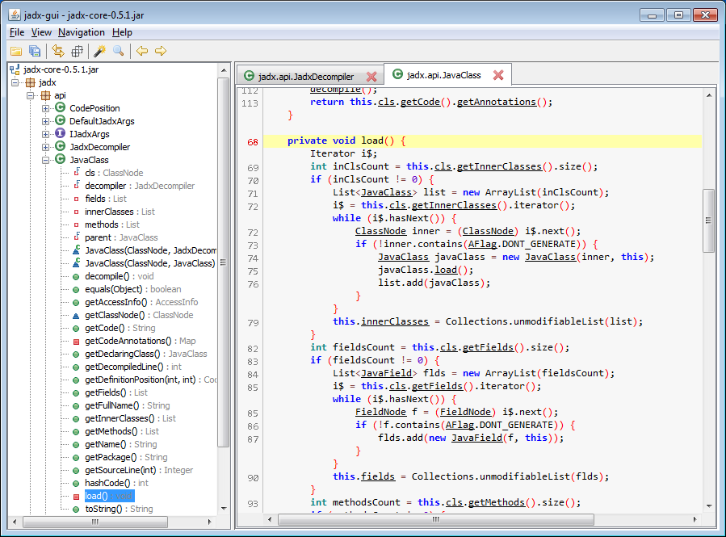
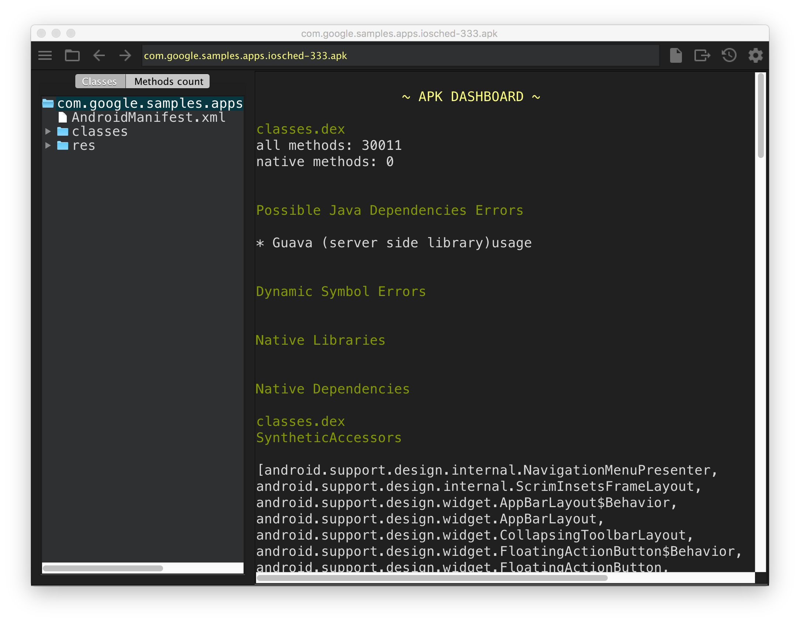
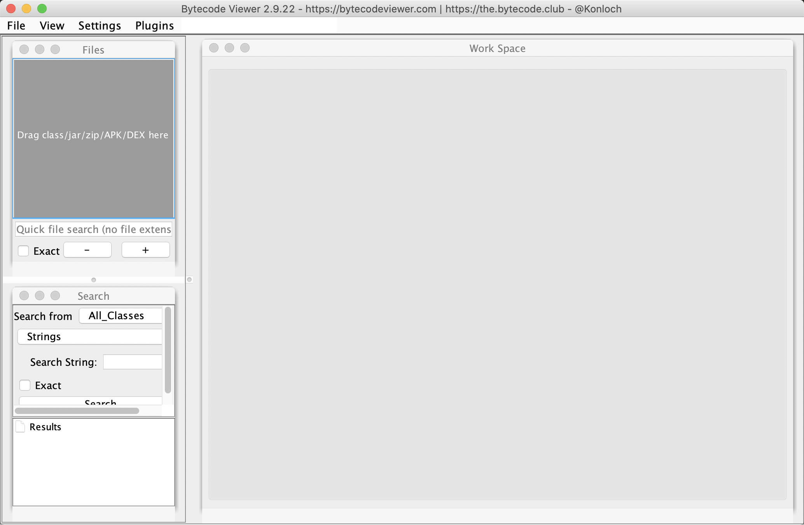

# decompile-apk
The decompile-apk tool consists of some scripts and different tools, it can provider auto decompile function for produce Java source code and resources from Android Apk files that displayed on GUI.

* jd-gui  
   


* jadx  
 


* classyshark  



* bytecode-viewer



## Tools
* [Apktool](https://github.com/iBotPeaches/Apktool) : v2.4.1
* [dex2jar](https://github.com/pxb1988/dex2jar) : v2.1
* [jd-gui](https://github.com/java-decompiler/jd-gui) : v1.6.6
* [jadx](https://github.com/skylot/jadx) : v1.1.0
* [android-classyshark](https://github.com/google/android-classyshark) : v8.2
* [bytecode-viewer](https://github.com/Konloch/bytecode-viewer) : v2.9.22

## Platforms
* Mac
* Linux / Unix

## Download
[decompile-apk](https://github.com/venshine/decompile-apk/releases)

## Usage

```shell
# using integrated tools to decompile apk (recommend)
sh decompile-apk.sh *.apk

# using apktool/dex2jar/jd-gui to decompile apk
sh jdgui-apk.sh *.apk

# using jadx to decompile apk
sh jadx-apk.sh *.apk

# using classyshark to decompile apk
sh classyshark-apk.sh *.apk

# using bytecode-viewer to decompile apk
sh bytecode-viewer.sh *.apk

```

## Summary
* Apktool
	* advantage
		* complete resource files
		* source code in detail
	* disadvantage
		* using more complex, need for a combination of multiple tools
		* cannot better view the APK architecture logic
* classyshark
	* advantage
		* easy to use, just a command line
		* source directory structure is clear, view the entire APK architecture graphically
	* disadvantage
		* source code too simple
		* cannot get resource files
* jadx
	* advantage
		* convenient and quick
		* more perfect GUI interface, with more practical functions
		* decompile code readability is high
	* disadvantage
		* resource files partially missing

* bytecode-viewer
	* advantage
		* support apk, dex, jar, and so on
		* better visual feedback
	* disadvantage
		* analyse file slower

## Todo
* more decompile tools
* support decompile dex/aar/jar files

## About
[venshine.cn@gmail.com](venshine.cn@gmail.com)

## License
[Apache 2.0](http://www.apache.org/licenses/LICENSE-2.0.html)